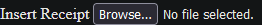
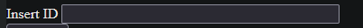

# receipt-processor-challenge

This is my submission of the receipt processor challenge for Fetch Reward's Backend Engineering Apprenticeship.
This project was made using the Flask framework wih HTML and CSS for the frontend, and with Python for the backend, and is ran within a Docker container.

This application takes in a JSON receipt and produces a JSON object with a randomly generated ID.
You can than input the given ID to get a JSON object containing the number of points that the receipt was rewarded.

# Prerequisite

Have Docker installed

# Install:

git clone https://github.com/GamingSteven9/receipt-processor-challenge.git

cd receipt-processor-challenge

Build the docker image:

docker build --tag receipt-processor-challenge .

# Run:

docker run --publish 8000:5000 -t -i receipt-processor-challenge

Open http://localhost:8000/receipts in a browser

# Test:

Input the ID into the text field

Click the "Get Points" button to get the points

# Credits

https://github.com/fetch-rewards/receipt-processor-challenge

https://docs.docker.com/language/python/

https://flask.palletsprojects.com/en/2.3.x/

https://docs.python.org/3/

https://developer.mozilla.org/en-US/docs/Web/HTML

https://developer.mozilla.org/en-US/docs/Web/CSS

https://wtforms.readthedocs.io/en/3.0.x/