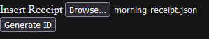
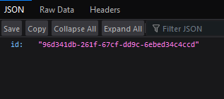
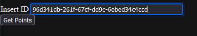
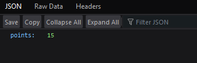

# receipt-processor-challenge

# Table of contents
1. [Introduction](#Introduction)
2. [Prerequisite](#Prerequisite)
3. [Install](#Install)
4. [Run](#Run)
5. [Test](#Test)
5. [Credits](#Credits)

# Introduction

This is my submission of the receipt processor challenge for Fetch Reward's Backend Engineering Apprenticeship.
This application takes in a JSON receipt and produces a JSON object with a randomly generated ID.
You can then input the given ID to get a JSON object containing the number of points that the receipt was rewarded.

This project was made using the Flask framework with HTML and CSS for the frontend, and with Python for the backend, and is ran within a Docker container.
I used Python to build the backend since it is the language that I am most experienced with.

One of the challenges that I faced during this project was working with the Flask framework since it has been a while since I had used it.
One improvement that I could make for this project would be to have better error handling when the user enters a non '.json' file or when they enter an unknown ID.

# Prerequisite

Have Docker installed

# Install:

git clone https://github.com/GamingSteven9/receipt-processor-challenge.git

cd receipt-processor-challenge

Build the docker image:

docker build --tag receipt-processor-challenge .

# Run:

docker run --publish 8000:5000 -t -i receipt-processor-challenge

Open http://localhost:8000/receipts in a browser

# Test:

Insert a JSON receipt into the file field

Click the "Generate ID" button to get the ID

Example output

Input the ID into the text field

Click the "Get Points" button to get the points

Example output

# Credits

https://github.com/fetch-rewards/receipt-processor-challenge

https://docs.docker.com/language/python/

https://flask.palletsprojects.com/en/2.3.x/

https://docs.python.org/3/

https://developer.mozilla.org/en-US/docs/Web/HTML

https://developer.mozilla.org/en-US/docs/Web/CSS

https://wtforms.readthedocs.io/en/3.0.x/